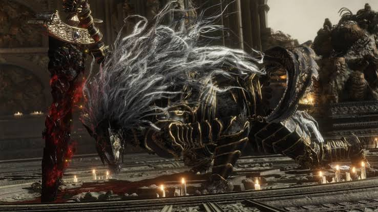

  Estudante de Ciência da Computação na UEPB, com foco em desenvolvimento backend.
   
  Atualmente aprofundando meus estudos em Java, Spring Boot e APIs REST.
   
  Buscando transformar aprendizado em projetos e construir minha trajetória na área de desenvolvimento.

---

 

### "Mesmo entre as ruínas, ainda há algo a construir."

---

## Tecnologias

### Backend

  
  
  
  

### Frontend

  
  
  
  
  

### Banco de Dados

  

### DevOps

  
  
  

### IA & Integrações

  
  

---

## Estatísticas

---

## Contato

 

**Sempre aprendendo. Sempre construindo.**

